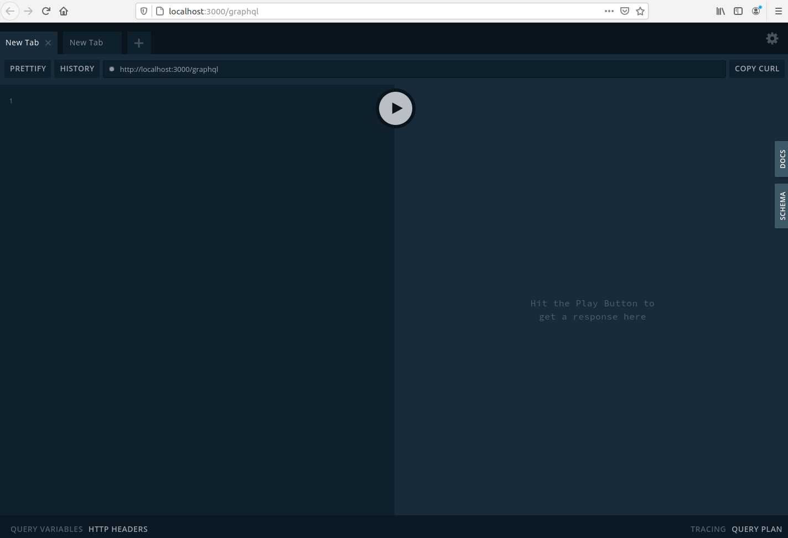
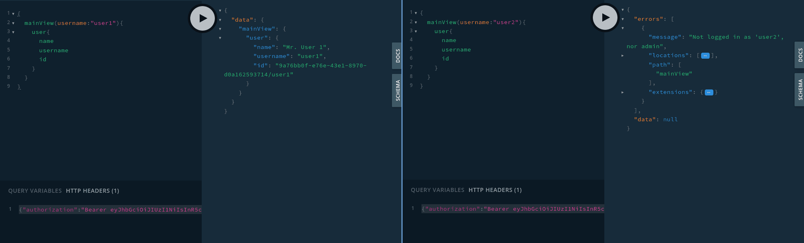

# Autenticazione

TuringArena implementa una autenticazione delle chiamate alle API GraphQL fornite dal server che vengono servite soltanto se l'utente che ne fa richiesta possiede i permessi necessari.

## Come abilitare o disattivare l'autenticazione delle chiamate

All'interno del file [`server\turingarena.config.json`](../server/turingarena.config.json) che viene qui sotto riportato è presente il parametro `skipAuth`. Tale parametro se impostato a `true` permette al server di accettare richieste da chiunque. Sebbene possa essere utile tale opzione durante le fasi di testing, consigliamo di settarlo a `false` nel resto dei casi per impedire potenziali consultazioni o modifiche al database non desiderate.

```json
{
    "db": {
        "storage": "db.sqlite3",
        "dialect": "sqlite"
    },
    "host": "localhost",
    "port": 3000,
    "secret": "superSecretCode",
    "skipAuth": true
}

```

## Come effettuare le chiamate autenticate dall'interfaccia GraphQL

Per prima cosa è necessario accedere all'interfaccia online di GraphQl recandosi al link specificato all'interno del file  [`server\turingarena.config.json`](../server/turingarena.config.json) .

Nel nostro caso l'url da digitare è [`http://localhost:3000/graphql`](http://localhost:3000/graphql)

Si aprirà una pagina simile a questa:



Nella parte di sinistra andremo a inserire le nostre richieste mentre nella parte di destra il server ci mostrerà la risposta alla nostra query.

Quando l'utente si autentica dal browser viene inviata una mutazione al server Apollo nella quale viene passata la password dell'utente e in cambio il server risponde con un token. Tale token viene poi utilizzato come metodo di autenticazione per le chiamate successive.

Per richiedere il nostro token andiamo dunque a digitare il seguente codice

```
mutation{
	logIn(token: "<pwduser>"){
    	token
  	}
}
```

dove al posto di `<pwduser>` va inserita la propria password

Si vedrà apparire sulla destra una risposta simile a questa:

```
{
  "data": {
    "logIn": {
      "token": "eyJhbzZXIxIiwiaWF0IjoxNjAyGciOi
      ...
      uT1yfdCOpi_gB8NFn3Go4aFI"
    }
  }
}
```


Ora che il server ci ha comunicato il nostro token possiamo in basso a sinistra aprire la finestra HTTP HEADERS e inserire il seguente codice dove al posto di `<token>` andrà inserito il token copiato.

```
{"authorization":"Bearer <token>"}
```

Prestare attenzione a lasciare uno spazio tra `Bearer` e il token

**Esempio:**

Nella seguente schermata abbiamo un utente ( `user1` ) che ha già effettuato il login e ottenuto il proprio token che effettua due chiamate al server GraphQL . Nella chiamata di sinistra lo vediamo richiedere informazioni riguardanti a se stesso e il server gli risponde correttamente con le informazioni richieste. Quando però tenta di ottenere informazioni riguardanti un `user2` gli viene risposto che non ha i permessi per fare tale richiesta. 



